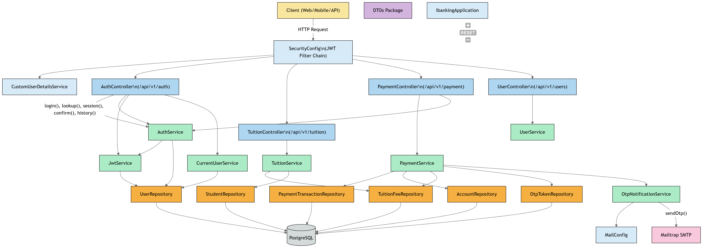

# iBanking - TDTU Tuition Payment API

[](https://spring.io/projects/spring-boot)
[](https://www.java.com/)
[](https://www.postgresql.org/)

> A secure REST API for handling tuition payments at TDTU University with OTP verification, JWT authentication, and comprehensive transaction management.

## Table of Contents

- [Overview](#overview)
- [Features](#features)
- [Installation](#installation)
- [Configuration](#configuration)
- [API Documentation](#api-documentation)
  - [Authentication](#authentication)
  - [Endpoints](#endpoints)
- [Payment Flow](#payment-flow)
- [Security](#security)
- [Testing](#testing)
- [Development](#development)
- [Environment Variables](#environment-variables)
- [Project Structure](#project-structure)
- [Contributing](#contributing)
- [License](#license)

## Overview

The iBanking API is a Spring Boot application designed specifically for processing tuition payments at Ton Duc Thang University (TDTU). It provides a secure and reliable platform for students to pay their tuition fees with OTP verification, robust authentication, and comprehensive transaction tracking.

## System Diagram


## Features

- 🔐 **JWT Authentication** - Secure token-based authentication system
- 📧 **OTP Verification** - Two-factor authentication via email using Mailtrap
- 💳 **Payment Processing** - Secure tuition payment flow with transaction management
- 🔒 **Concurrency Control** - Pessimistic locking to prevent double-spending
- 📊 **Transaction History** - Comprehensive payment tracking and history
- 🔄 **Idempotency Support** - Prevention of duplicate transactions
- 🛡️ **Security Best Practices** - Input validation, SQL injection prevention
- 📝 **RESTful API** - Clean, consistent API design following REST principles

## Installation

### Prerequisites

- Java 17 or higher
- PostgreSQL 12 or higher
- Gradle 8.x or higher (or use the provided Gradle wrapper)

### Quick Start

1. Clone the repository:
   ```bash
   git clone https://github.com/your-username/ibanking.git
   cd ibanking
   ```

2. Set up the database:
   - Install and start PostgreSQL
   - Create a database for the application
   - Update the database connection settings in `application.properties`

3. Configure environment variables (see [Environment Variables](#environment-variables) section)

4. Build and run the application:
   ```bash
   ./gradlew bootRun
   ```

5. The API will be available at `http://localhost:8080`

### Building the Application

```bash
# Build the application
./gradlew build

# Run tests
./gradlew test

# Run the application
./gradlew bootRun
```

## Configuration

### Database Configuration

Update the `application.properties` file with your PostgreSQL connection details:

```properties
spring.datasource.url=jdbc:postgresql://localhost:5432/ibanking
spring.datasource.username=your_username
spring.datasource.password=your_password
spring.datasource.driver-class-name=org.postgresql.Driver
```

### Mailtrap Configuration

For development environments, configure Mailtrap SMTP settings:

```properties
spring.mail.host=sandbox.smtp.mailtrap.io
spring.mail.port=2525
spring.mail.username=your_mailtrap_username
spring.mail.password=your_mailtrap_password
spring.mail.properties.mail.smtp.auth=true
spring.mail.properties.mail.smtp.starttls.enable=true
app.mail.from=no-reply@ibanking.local
```

### JWT Configuration

Configure JWT secret and expiration settings:

```properties
app.jwt.secret=your-super-secret-jwt-key
app.jwt.expiration=86400000
```

## API Documentation

### Base URL

All API endpoints are prefixed with `/api/v1/`

### Authentication

This API uses JWT (JSON Web Token) authentication. To access protected endpoints:

1. Obtain a token by authenticating via `POST /api/v1/auth/login`
2. Include the token in the `Authorization` header as `Bearer <token>`

### Endpoints

#### Authentication

##### Login
`POST /api/v1/auth/login`

Authenticate a user and receive a JWT token.

**Request:**
```json
{
  "username": "admin",
  "password": "secret"
}
```

**Response:**
```json
{
  "token": "eyJhbGciOiJIUzI1NiIsInR5cCI6IkpXVCJ9...",
  "tokenType": "Bearer"
}
```

##### Request Headers
- `Content-Type: application/json`

#### Tuition Management

##### Get Tuition Information
`GET /api/v1/tuition/{studentId}?term={term}`

Retrieve tuition fee information for a specific student and term.

**Parameters:**
- `studentId` (path) - The student's ID
- `term` (query) - The academic term (e.g., "2025-1")

**Response:**
```json
{
  "studentId": "521H0507",
  "studentName": "Nguyen Van A",
  "amount": 1250.0,
  "term": "2025-1",
  "status": "UNPAID"
}
```

**Required Headers:**
- `Authorization: Bearer <token>`

#### Payment Processing

##### Create Payment Session
`POST /api/v1/payments/session`

Initiate a new payment session for tuition payment.

**Request:**
```json
{
  "studentId": "521H0507",
  "term": "2025-1",
  "amount": 1250.0,
  "idempotencyKey": "5e9d7c12-3b6d-4c3f-b8d1-9f4a8a6be8ce"
}
```

**Response:**
```json
{
  "txId": "0f07d2f9-2f2e-4e1b-9d4d-6056f141755a",
  "status": "OTP_SENT"
}
```

**Required Headers:**
- `Authorization: Bearer <token>`
- `Content-Type: application/json`

##### Confirm Payment
`POST /api/v1/payments/confirm`

Confirm payment with the OTP received via email.

**Request:**
```json
{
  "txId": "0f07d2f9-2f2e-4e1b-9d4d-6056f141755a",
  "otp": "123456"
}
```

**Response:**
```json
{
  "status": "SUCCESS",
  "referenceCode": "TX-4C8FD2B7AA33",
  "newBalance": 8750.0
}
```

**Required Headers:**
- `Authorization: Bearer <token>`
- `Content-Type: application/json`

##### Resend OTP
`POST /api/v1/payments/{txId}/otp/resend`

Resend OTP for a payment transaction that is still pending confirmation.

**Parameters:**
- `txId` (path) - The transaction ID

**Response:**
```json
{
  "status": "OTP_SENT"
}
```

**Required Headers:**
- `Authorization: Bearer <token>`

#### Transaction History

##### Get Transaction History
`GET /api/v1/payments/transactions`

Retrieve payment transaction history with optional filters.

**Query Parameters:**
- `from` (optional) - ISO-8601 instant for start date filter
- `to` (optional) - ISO-8601 instant for end date filter
- `page` (optional) - Page number (default: 0)
- `size` (optional) - Page size (default: 20)

**Response:**
```json
{
  "items": [
    {
      "referenceCode": "TX-4C8FD2B7AA33",
      "amount": 1250.0,
      "status": "SUCCESS",
      "createdAt": "2025-10-23T22:21:05.123Z"
    }
  ],
  "page": 0,
  "size": 20,
  "totalElements": 1,
  "totalPages": 1
}
```

**Required Headers:**
- `Authorization: Bearer <token>`

## Payment Flow

The tuition payment process involves several steps to ensure security and reliability:

1. **Tuition Lookup**: User queries tuition information using student ID and term
2. **Session Creation**: User creates a payment session with student ID, term, amount and idempotency key
3. **OTP Generation**: System generates a unique OTP and sends it to the user's registered email
4. **Payment Confirmation**: User submits the received OTP to confirm the transaction
5. **Transaction Processing**: System validates OTP, checks account balance, updates tuition status, and marks transaction as successful
6. **History Tracking**: All transactions are stored for future reference and audit

## Security

### Authentication & Authorization
- JWT tokens with configurable expiration time
- Secure token storage and validation
- Role-based access control

### Data Protection
- Passwords are encrypted using bcrypt
- Sensitive data is not logged
- SQL injection prevention through parameterized queries

### Concurrency & Idempotency
- Pessimistic locking using `findByIdForUpdate` prevents double-spending
- Idempotency keys prevent duplicate transactions
- Database constraints ensure data integrity

### Email Security
- OTP tokens expire after a configurable period
- Limited attempts to prevent brute-force attacks
- Rate limiting for OTP resend requests

## Testing

### Running Tests

Execute all tests:
```bash
./gradlew test
```

Run tests with coverage report:
```bash
./gradlew test jacocoTestReport
```

### Test Categories

- Unit tests for individual components
- Integration tests for API endpoints
- Security tests for authentication flows
- Database tests for repository operations

## Development

### Project Setup

1. Fork and clone the repository
2. Import the project into your preferred IDE (IntelliJ IDEA, Eclipse, VS Code)
3. Install Java 17 and PostgreSQL
4. Set up the database and configure environment variables

### API Development Guidelines

- Follow REST conventions for endpoint design
- Use consistent naming for endpoints and response fields
- Implement proper error handling with appropriate HTTP status codes
- Document all endpoints with clear request/response examples
- Include validation for all user inputs
- Use logging for debugging and monitoring

### Running Locally

```bash
# Using Gradle wrapper
./gradlew bootRun

# With custom profile
./gradlew bootRun --args='--spring.profiles.active=dev'

# Using IDE
# Run IbankingApplication.java as a Spring Boot application
```

## Environment Variables

The application requires the following environment variables:

| Variable | Description | Default |
|----------|-------------|---------|
| `SPRING_DATASOURCE_URL` | PostgreSQL database URL | `jdbc:postgresql://localhost:5432/ibanking` |
| `SPRING_DATASOURCE_USERNAME` | Database username | `postgres` |
| `SPRING_DATASOURCE_PASSWORD` | Database password | `` |
| `SPRING_MAIL_HOST` | SMTP host for email service | `sandbox.smtp.mailtrap.io` |
| `SPRING_MAIL_PORT` | SMTP port | `2525` |
| `SPRING_MAIL_USERNAME` | SMTP username | `` |
| `SPRING_MAIL_PASSWORD` | SMTP password | `` |
| `APP_JWT_SECRET` | Secret key for JWT tokens | `your-super-secret-jwt-key` |
| `APP_JWT_EXPIRATION` | JWT token expiration in milliseconds | `86400000` |
| `APP_MAIL_FROM` | Sender email address | `no-reply@ibanking.local` |

## Project Structure

```
src/
├── main/
│   ├── java/vn/id/nhanbe/ibanking/
│   │   ├── controller/          # REST API controllers
│   │   ├── dto/                 # Data Transfer Objects
│   │   ├── model/               # JPA entities
│   │   ├── repository/          # Spring Data JPA repositories
│   │   ├── service/             # Business logic
│   │   ├── config/              # Configuration classes
│   │   ├── security/            # Security implementation
│   │   └── IbankingApplication.java
│   └── resources/
│       └── application.properties  # Configuration properties
└── test/
    └── java/                    # Unit and integration tests
```

## Contributing

We welcome contributions to improve the iBanking API! Here's how you can contribute:

### Getting Started

1. Fork the repository
2. Create a feature branch (`git checkout -b feature/amazing-feature`)
3. Make your changes
4. Add tests if applicable
5. Ensure all tests pass (`./gradlew test`)
6. Commit your changes (`git commit -m 'Add amazing feature'`)
7. Push to the branch (`git push origin feature/amazing-feature`)
8. Open a Pull Request

### Code Standards

- Follow the existing code style and conventions
- Write clear, descriptive commit messages
- Include tests for new features
- Update documentation as needed
- Keep pull requests focused on a single feature or fix

### Reporting Issues

When reporting issues, please include:
- Detailed steps to reproduce the problem
- Expected vs. actual behavior
- Environment information (Java version, OS, etc.)
- Relevant logs or error messages

## License

This project is licensed under the MIT License - see the [LICENSE](LICENSE) file for details.

---

Made with ❤️+☕ for TDTU University
